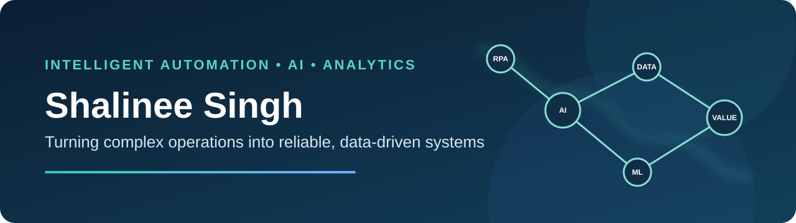
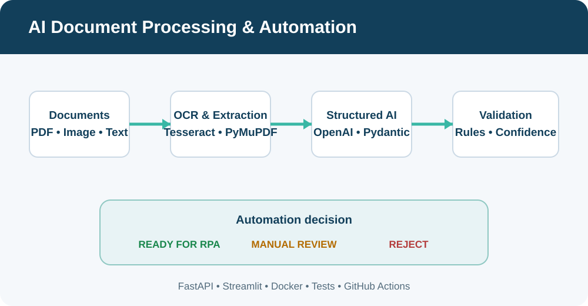

  

  
  

## What I build

I am an **Intelligent Automation & Analytics Engineer** with 10+ years of experience transforming complex business operations into reliable automated systems. My work spans RPA delivery, process analysis, AI-assisted document processing, machine learning, and decision-ready analytics across banking, finance, HR, and healthcare.

I have delivered 50+ production automations using Blue Prism and UiPath, led initiatives from discovery through production support, and translated operational problems into measurable technical solutions. I am currently pursuing an **MS in Business Analytics at DePaul University with a 4.0 GPA**, expanding this foundation through applied AI, machine learning, and data visualization.

## Impact snapshot

| Enterprise delivery | Intelligent automation | Applied analytics | Current focus |
|:---:|:---:|:---:|:---:|
| **10+ years** in IT | **50+ bots** in production | Python, ML & Tableau | MS Business Analytics |
| End-to-end ownership | Blue Prism & UiPath | Business-first modeling | AI-enabled operations |

## Signature projects

<table>
<tr>
<td width="33%" valign="top">

<h3>AI Document Processing</h3>

Converts invoices into validated, RPA-ready JSON through OCR, structured AI extraction, deterministic controls, and confidence-based routing.

<strong>Python • OpenAI • FastAPI • Streamlit • Docker</strong>

<a href="https://github.com/shalineesinghvit12-source/ai-document-processing-automation">Explore the project →</a>

</td>
<td width="33%" valign="top">

<h3>RPA SLA Prediction</h3>

Analyzes 620 cleaned bot runs, identifies operating profiles, and predicts SLA outcomes. Logistic regression achieved 72.04% accuracy and 0.801 ROC-AUC.

<strong>Python • Clustering • Logistic Regression • PCA</strong>

<a href="https://github.com/shalineesinghvit12-source/rpa-sla-prediction-ml">Explore the project →</a>

</td>
<td width="33%" valign="top">

<h3>Revenue Forecasting</h3>

Connects executive KPIs, actual-versus-predicted analysis, regional profitability, and an interactive advertising-spend scenario.

<strong>Tableau • Forecast Analysis • KPI Design • What-if Analysis</strong>

<a href="https://github.com/shalineesinghvit12-source/ai-revenue-forecasting-tableau">Explore the project →</a>

</td>
</tr>
</table>

## Core toolkit

  
  
  
  
  
  
  
  
  
  

**Automation:** Blue Prism, UiPath, OCR/IDP, REST APIs, exception handling, production support  
**Analytics:** Python, SQL, pandas, scikit-learn, Tableau, Excel  
**Delivery:** Requirements analysis, process design, ROI analysis, stakeholder workshops, Agile delivery

## Additional analytics work

- [Customer Churn Prediction](https://github.com/shalineesinghvit12-source/customer-churn-logistic-regression) — interpretable logistic regression with automated notebook validation
- [Retail Sales & Profitability Dashboard](https://github.com/shalineesinghvit12-source/retail-sales-profitability-tableau) — product, segment, operational-cost, and geographic analysis
- [Flight Price Prediction](https://colab.research.google.com/drive/1Y_UzfMizA_SdK-x037V3i2dKk_Dc8bwX) — Random Forest and linear-regression comparison
- [Advertising Spend & Sales Prediction](https://colab.research.google.com/drive/1sjuuM2YU0cxR95IonXIldE8WBNmhuO27) — multiple linear regression with model-error analysis
- [UK Crime Prediction with AWS SageMaker](https://colab.research.google.com/drive/1h-F3qfIR2sjAFpGmIqwkqGw2GzJo77tF) — XGBoost classification on 250K+ records

## Let’s connect

I am interested in intelligent automation, RPA, business analytics, and AI-enabled operational solutions.

[LinkedIn](https://www.linkedin.com/in/shalinee-singh-14625569) • [Email](mailto:shalineesingh.vit12@gmail.com)
