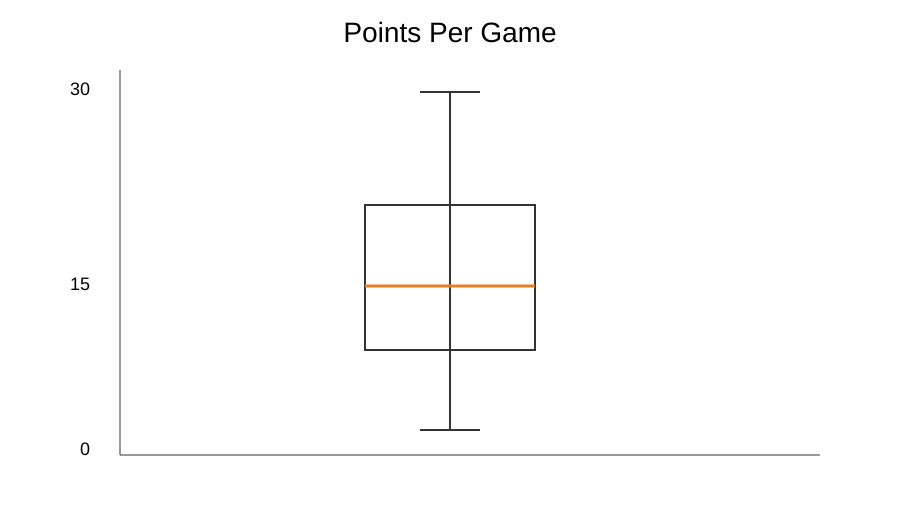
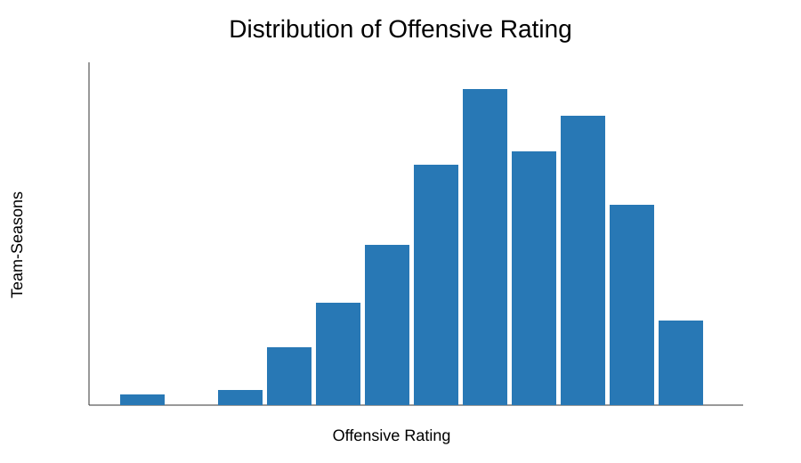
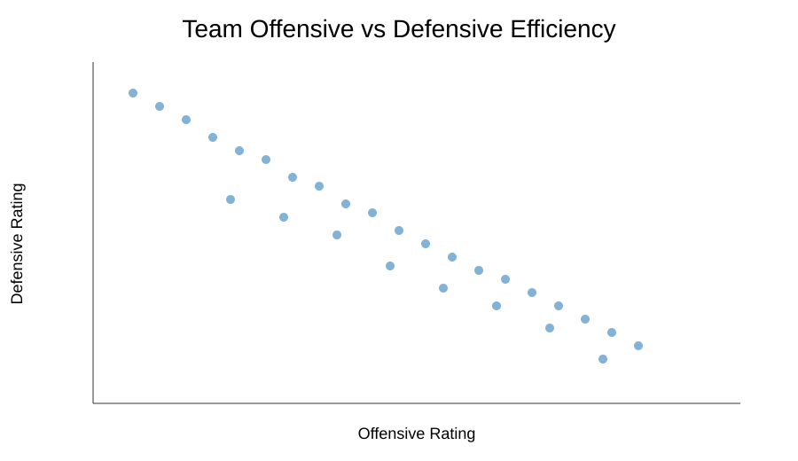
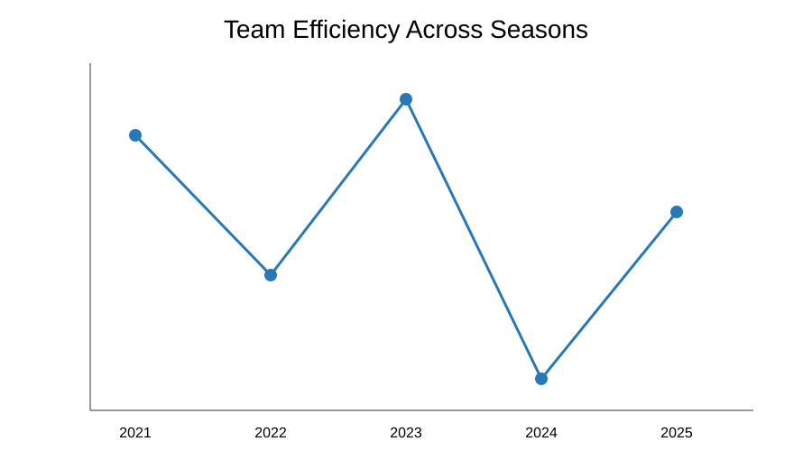
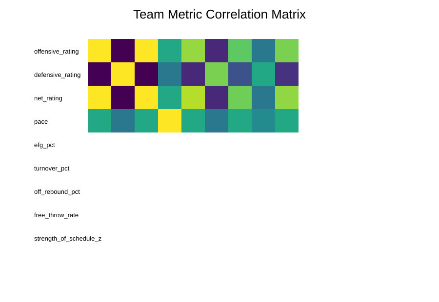
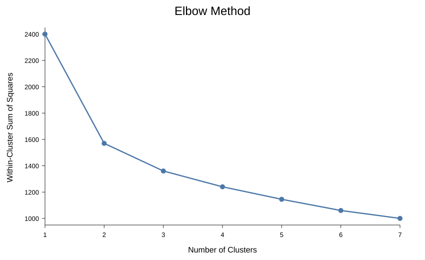
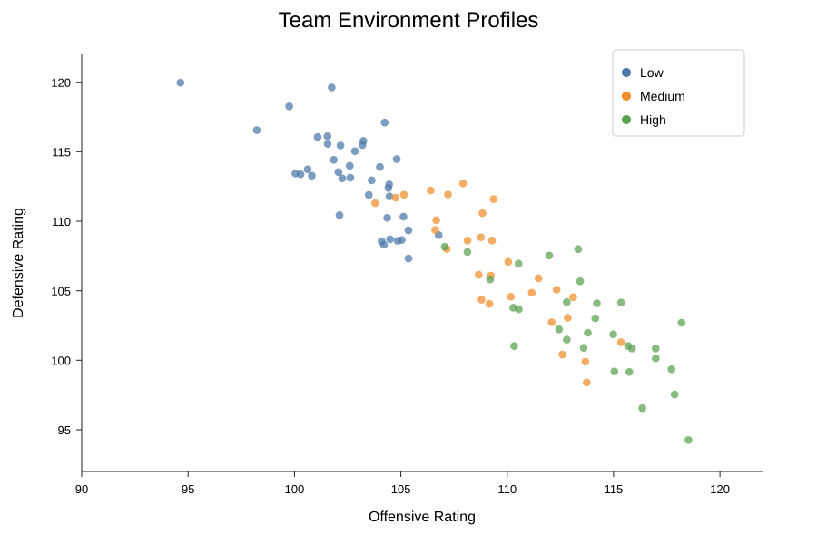

# NCAA Transfer Performance Translation Model

A Python basketball analytics proof of concept built around one question:

> **How might a player's performance translate when moving from one competitive team environment to another?**

The project follows an end-to-end analytics workflow for a transfer-portal / recruiting use case:

`clean & validate → EDA → K-means team profiles → transfer feature engineering → Linear Regression / Decision Tree / Random Forest → KNN comparables → staff-facing output`

> **Data note:** The public repository uses deterministic synthetic NCAA-like demo data so the workflow can run end to end without redistributing licensed or proprietary data. The same pipeline is designed to accept validated historical team, player-season, and transfer data.

## Google Colab analysis visuals

These views correspond to the exploratory analysis and team-profiling work completed in Google Colab.

### 1. Player PPG distribution / outlier check



Used during data-quality review to understand the player scoring distribution and inspect extreme values rather than automatically removing high performers.

### 2. Offensive Rating distribution



Shows the spread of team offensive efficiency across the five-season dataset.

### 3. Offensive vs Defensive Efficiency



This view helps explain overall team environments: stronger teams generally combine higher offensive efficiency with lower defensive rating.

### 4. Team efficiency across seasons



Used to review whether average team efficiency shifts meaningfully by season before combining multiple years of data.

### 5. Team metric correlation matrix



Used to understand relationships among ORtg, DRtg, Net Rating, pace, shooting, turnover, rebounding, free-throw rate, and schedule strength.

### 6. K-means elbow analysis



The basketball use case calls for Low / Medium / High environments, so three clusters are used. The elbow view serves as a reasonableness check rather than choosing K blindly.

### 7. Low / Medium / High team environment profiles



Team-season observations are standardized and grouped with K-means. The resulting clusters are ordered by average Net Rating and labeled **Low**, **Medium**, and **High**.

## Business questions

1. What do team environments look like over multiple seasons?
2. Can team-seasons be segmented into Low / Medium / High statistical profiles?
3. What historically happens when players move Low → High, Medium → High, High → High, and other transitions?
4. Which pre-transfer player and team-context features are most useful for explaining post-transfer performance?
5. Can historical data estimate post-transfer Offensive Rating, True Shooting %, PPG, and Usage %?
6. Which historical transfers are most statistically similar to a current candidate?

## Data used in a real-world version

The pipeline expects three logical tables:

- `team_seasons` — one row per team-season
- `player_seasons` — one row per player-team-season
- `transfers` — one row per school-to-school move, or derived from consecutive player seasons

The included demo generator produces the same logical structure.

## Data cleaning and validation

The workflow checks schema, data types, season coverage, duplicate team-season records, missing modeling features, text consistency for team joins, and source/destination keys. Net Rating is calculated as:

`Net Rating = Offensive Rating - Defensive Rating`

Extreme basketball performances are investigated before exclusion because a legitimate high-performing player can be a valid outlier.

## Team profiling with K-means

Team profile features include:

- Offensive Rating
- Defensive Rating
- Pace
- Effective Field Goal %
- Turnover %
- Offensive Rebound %
- Free Throw Rate
- Strength of Schedule

Features are standardized with `StandardScaler` before K-means because clustering is distance-based. K-means creates three clusters, which are ordered by average Net Rating and mapped to Low / Medium / High.

## Transfer modeling table

Each historical transfer becomes one model row containing:

**Pre-transfer player features:** minutes/game, PPG, Usage %, TS%, Assist %, Turnover %, Rebound %, Player ORtg.

**Source context:** source ORtg, DRtg, Net Rating, schedule strength, and team tier.

**Destination context:** destination ORtg, DRtg, Net Rating, schedule strength, and team tier.

**Transition:** for example `Low → High` or `Medium → High`.

**Observed outcomes:** post-transfer Player ORtg, TS%, PPG, and Usage %.

## Predictive models

The regression models intentionally match standard supervised-learning coursework:

- **Linear Regression** — interpretable baseline
- **Decision Tree Regression** — nonlinear threshold relationships
- **Random Forest Regression** — ensemble model for more complex interactions

Models are compared using:

- **MAE** — average absolute prediction error; lower is better
- **R²** — proportion of outcome variation explained

The model with the lowest test MAE is selected for each target.

## Validation design

The modeling code prefers a time-based split:

> **train on earlier transfer seasons → test on the most recent destination season**

This more closely resembles the real recruiting workflow than randomly mixing past and future seasons. A deterministic 75/25 fallback is available for small demo samples.

## KNN comparable-player layer

Nearest-neighbor similarity is used as an interpretation layer. A candidate can be compared with historical transfers based on pre-transfer PPG, Usage %, TS%, Player ORtg, source team context, and destination context.

This allows the dashboard to show both a model projection and the most similar historical transfer profiles.

## Streamlit decision-support dashboard

`app/streamlit_app.py` allows a user to:

- choose a destination team-season
- review destination ORtg, DRtg, Net Rating, and tier
- enter a candidate's pre-transfer production
- enter source-team context
- project post-transfer ORtg, TS%, PPG, and Usage %
- view selected-model accuracy
- review five comparable transfer records
- inspect historical transition summaries

The model is intended to support — not replace — film review, coaching judgment, role/lineup fit, medical information, player development, and direct scouting.

## Optional Phase 2: classification

If basketball staff define an operational outcome such as `successful high-major contributor: Yes/No`, a later phase could compare Logistic Regression, KNN Classification, Decision Tree Classification, and Random Forest Classification. The definition of success should come from staff.

## Project structure

```text
ncaa-transfer-performance-translation/
├── app/
│   └── streamlit_app.py
├── data/
│   └── README.md
├── outputs/
│   ├── README.md
│   ├── model_metrics.json
│   ├── transition_summary.csv
│   └── screenshots/
│       ├── points_per_game_boxplot.svg
│       ├── offensive_rating_distribution.svg
│       ├── team_offense_defense_efficiency.svg
│       ├── team_efficiency_by_season.svg
│       ├── team_metric_correlation.svg
│       ├── kmeans_elbow_method.svg
│       └── team_environment_profiles.svg
├── src/
│   ├── generate_demo_data.py
│   ├── build_model.py
│   ├── predict.py
│   └── visualize_results.py
├── run_pipeline.py
├── requirements.txt
└── README.md
```

## Run locally

```bash
python -m venv .venv
# Windows: .venv\Scripts\activate
# macOS/Linux: source .venv/bin/activate
pip install -r requirements.txt
python run_pipeline.py
streamlit run app/streamlit_app.py
```

## Moving to real historical data

Replace the demo CSVs with validated historical files using the documented schema and keep the same sequence:

`clean → validate → EDA → team profiling → transfers → feature engineering → time-based validation → historical comparables → staff-facing visualization`

Real basketball conclusions should only be reported after retraining and validating the pipeline on actual historical data.
