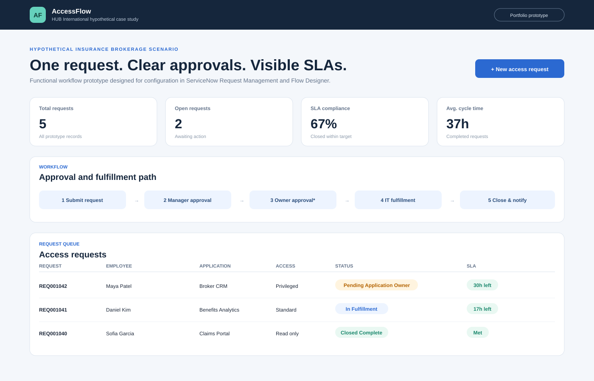
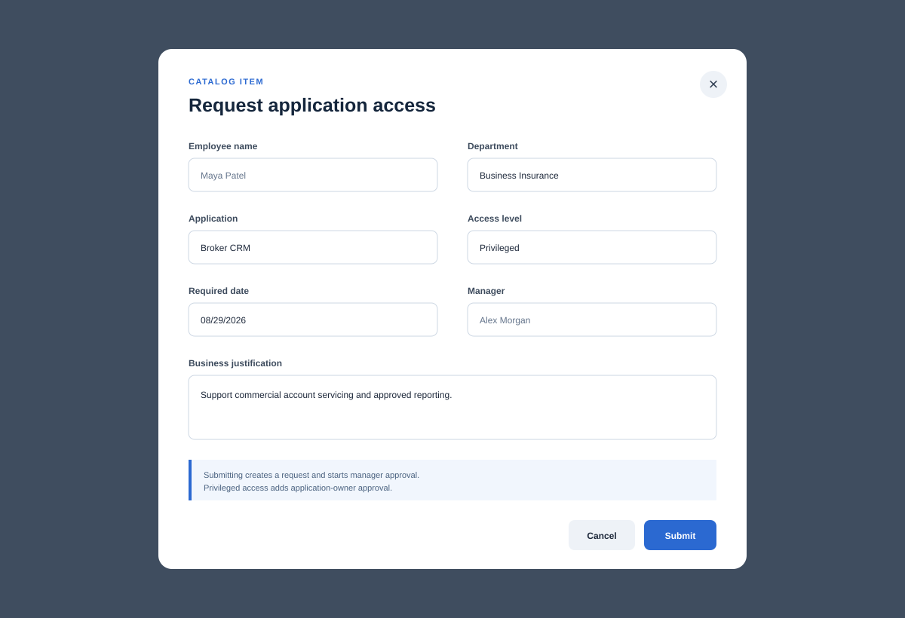
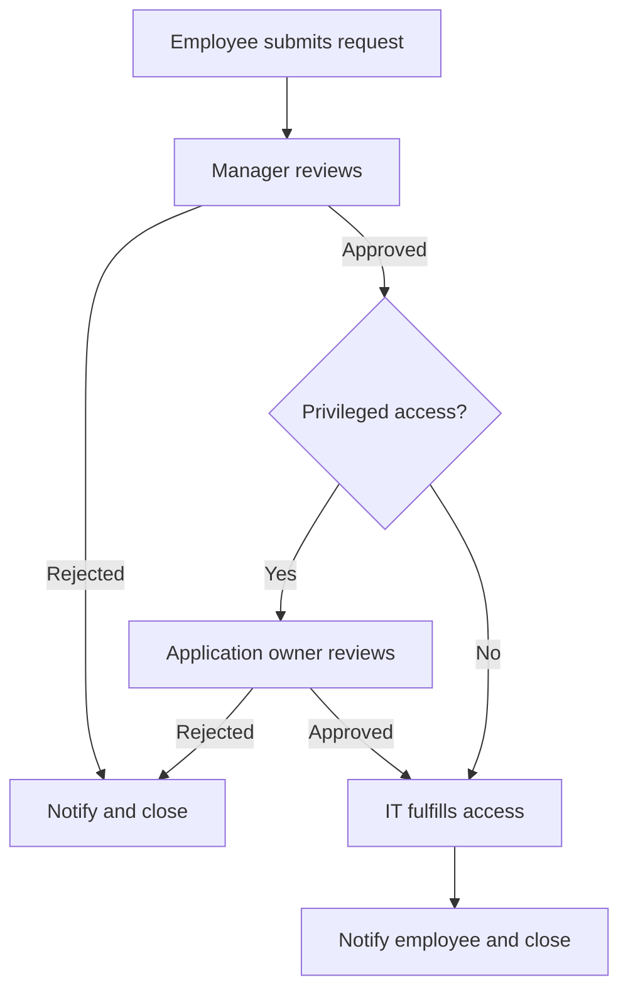

# ServiceNow Employee Access Request Workflow

A functional portfolio prototype and Business Analyst implementation package for an employee application-access request process, tailored as a hypothetical HUB International case study.

> **Important:** This is an independent hypothetical case study created from public company context and synthetic data. It was not commissioned, reviewed, or used by HUB International. The browser application demonstrates requirements and behavior before possible configuration in a ServiceNow Personal Developer Instance. It is not a production ServiceNow deployment.

## Case-study context

HUB International publicly describes itself as a North American insurance brokerage serving areas such as business insurance, employee benefits, and risk services. This project uses those public service categories only to create a relevant fictional access-management scenario. No internal process, system, employee, client, or performance data is used. [Public source: HUB International](https://www.hubinternational.com/)

## Business problem

Email-based access requests create incomplete information, inconsistent approvals, limited auditability, and avoidable follow-up. This project defines a controlled future-state process with standardized intake, risk-based approvals, fulfillment tasks, notifications, SLA visibility, and operational metrics.

## Prototype capabilities

- Catalog-style application access request form
- Mandatory-field and justification validation
- Manager approval for every request
- Application-owner approval for privileged access
- IT fulfillment and closure stages
- 48-hour SLA status with at-risk and breached indicators
- Role-based action filtering
- Searchable request queue
- Calculated request volume, backlog, cycle time, and SLA compliance
- Browser storage for demonstration data





## ServiceNow target design

| Prototype concept | Target ServiceNow component |
|---|---|
| Access request form | Service Catalog item and variables |
| Approval routing | Flow Designer approval actions |
| Fulfillment work | Requested Item and Catalog Task |
| SLA indicator | Task SLA / SLA Definition |
| Status notification | Flow Designer email or notification action |
| Dashboard metrics | Reports and Performance Analytics |

## Process



## Run locally

No packages are required.

1. Download or clone the repository.
2. Open `index.html` in a browser.
3. Select **New access request** to submit a record.
4. Use the role selector and request action buttons to move the request through the workflow.

Run the routing tests with:

```bash
npm test
```

## Business Analyst evidence

- [Business requirements](docs/business-requirements.md)
- [User stories and acceptance criteria](docs/user-stories.md)
- [Requirements traceability matrix](docs/traceability-matrix.md)
- [UAT plan and cases](docs/uat-plan-and-cases.md)
- [Support SOP](docs/support-sop.md)
- [Sample metrics and measurement plan](docs/sample-metrics.md)
- [Prototype screenshots](screenshots/README.md)

## Design assumptions

- Every request requires manager approval.
- Privileged access requires application-owner approval.
- The prototype uses a 48-hour end-to-end fulfillment target.
- Approval and fulfillment groups are represented as roles rather than real identities.
- All records and metrics are synthetic and used only for demonstration.

## Responsible portfolio use

Describe this as a hypothetical portfolio prototype and implementation blueprint. Do not represent it as HUB work, a production client implementation, or evidence of HUB's internal systems. Replace the mock records with approved test data before using the design in an enterprise environment.

## Author

Shalinee Singh  
[GitHub profile](https://github.com/shalineesinghvit12-source)

## Trademark notice

HUB International and ServiceNow are trademarks of their respective owners. This independent educational project is not affiliated with or endorsed by either company.
